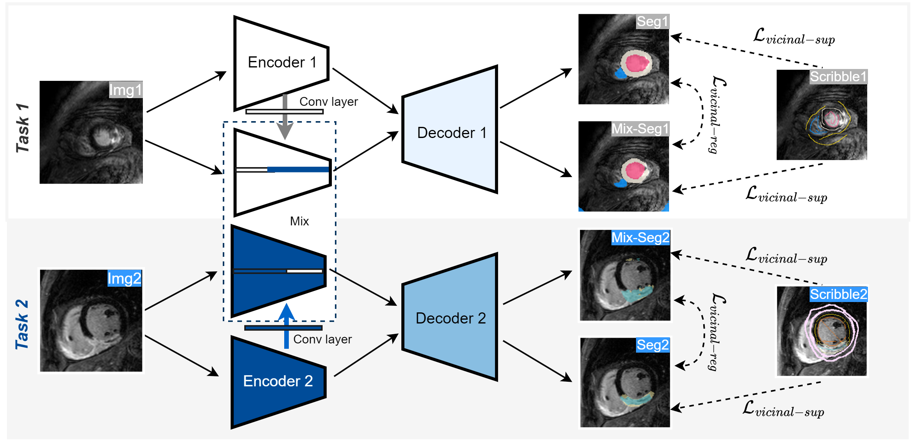

# ModelMix: A New Model-Mixup Strategy to Minimize Vicinal Risk across Tasks for Few-scribble based Cardiac Segmentation
This project is developed for our MICCAI 2024 paper: [ModelMix: A New Model-Mixup Strategy to Minimize Vicinal Risk across Tasks for Few-scribble based Cardiac Segmentation](https://arxiv.org/abs/2406.13237).  For more information about ModelMix, please read the following paper:

<div align=center></div>

```
@article{zhang2024modelmix,
  title={ModelMix: A New Model-Mixup Strategy to Minimize Vicinal Risk across Tasks for Few-scribble based Cardiac Segmentation},
  author={Zhang, Ke and Patel, Vishal M},
  journal={arXiv preprint arXiv:2406.13237},
  year={2024}
}
```
Please also cite this paper if you are using ModelMix for your research.

# Datasets
1. The MSCMR dataset with mask annotations can be downloaded from [MSCMRseg](https://zmiclab.github.io/zxh/0/mscmrseg19/data.html).
2. The scribble annotations of MSCMRseg have been released in [MSCMR_scribbles](https://github.com/BWGZK/CycleMix/tree/main/MSCMR_scribbles). 
3. The scribble-annotated MSCMR dataset used for training could be directly downloaded from [MSCMR_dataset](https://github.com/BWGZK/CycleMix/tree/main/MSCMR_dataset). 
4. The ACDC dataset with mask annotations can be downloaded from [ACDC](https://www.creatis.insa-lyon.fr/Challenge/acdc/) and the scribble annotations could be downloaded from [ACDC scribbles](https://vios-s.github.io/multiscale-adversarial-attention-gates/data). You can also directly download the [scribble-annotated ACDC dataset](https://github.com/BWGZK/ModelMix/tree/main/ACDC_dataset)
5. The MyoPS dataset can be downloaded in [MyoPS dataset](https://zmiclab.github.io/zxh/0/myops20/)
6. The scribbles of MyoPS dataset have been released in [MyoPS scribbles](https://github.com/BWGZK/ModelMix/tree/main/MyoPS_scribbles)
8.   Please organize the dataset as the following structure:
```
XXX_dataset/
  -- TestSet/
      --images/
      --labels/
  -- train/
      --images/
      --labels/
  -- val/
      --images/
      --labels/
```

# Usage
1. Set the "dataset" parameter in main.py, line 76, to the name of dataset, i.e., "MSCMR_dataset".
2. Set the "output_dir" in main.py, line 79, as the path to save the checkpoints. 
3. Download the dataset, for example, the [MSCMR_dataset](https://github.com/BWGZK/CycleMix/tree/main/MSCMR_dataset). Then, Set the dataset path in /data/mscmr.py, line 110, to your data path where the dataset is located in.
4. Check your GPU devices and modify the "GPU_ids" parameter in main.py, line 83 and "CUDA_VISIBLE_DEVICES" in run.sh.
5. Start to train by:.
```
python main.py
```

# Requirements

This code has been tested with  
Python 3.8.5  
torch  1.7.0  
torchvision 0.8.0  
gco-wrapper (https://github.com/Borda/pyGCO)  


If you have any problems, please feel free to contact us. Thanks for your attention.
